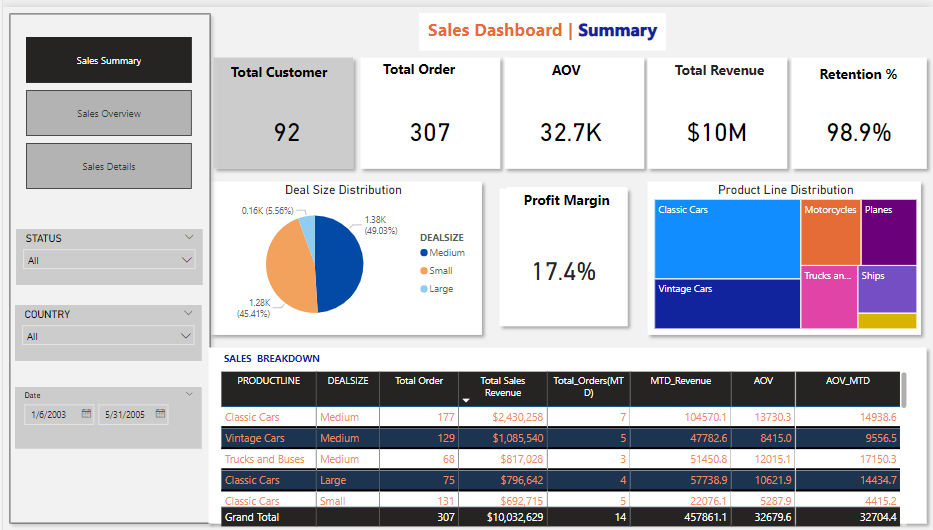
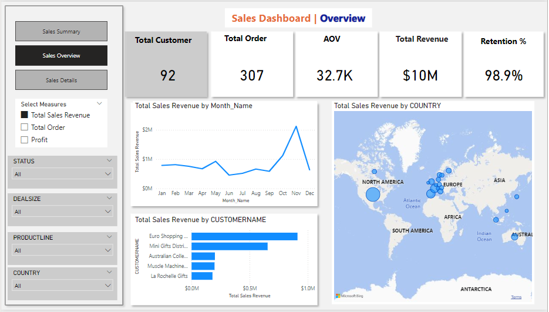
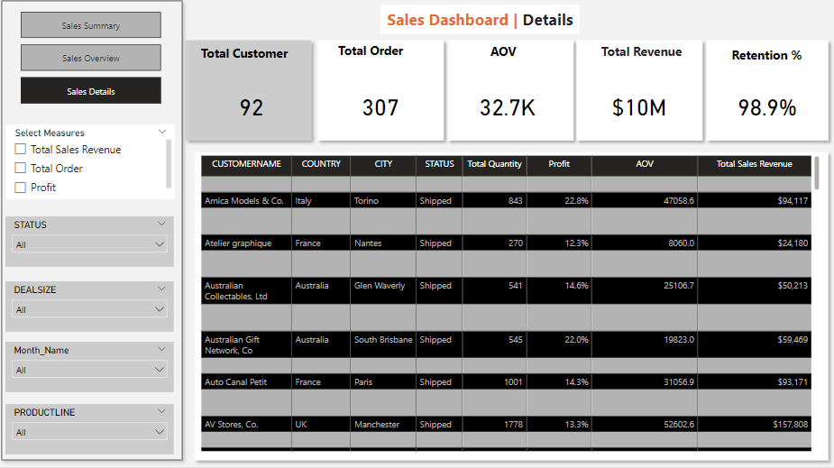

# 🧾 Sales-Data

  

## 📄 Description

The dataset contains sales transaction data, which can be analyzed to track performance, identify trends,  
and support decision-making for revenue growth. The goal is to evaluate sales performance across different  
time periods, product categories, and customer segments.  

The dataset has **2,823 records** with **25 columns**, including details such as order number, quantity,  
sales amount, product line, customer information, and date fields.

---

## 📊 Insight Summary

### 📌 Overall Performance

- **Total Revenue:** $10M  
- **Average Order Value (AOV):** $32.7K  
- **Total Orders:** 307  
- **Total Customers:** 92  
- **Customer Retention Rate:** 98.9%  
- **Profit Margin:** 17.4%

---

### 📉 Deal Size Distribution

- **Medium Deals:** 49.03% (1.38K orders) – Highest share  
- **Small Deals:** 45.41% (1.28K orders) – Slightly behind medium  
- **Large Deals:** 5.56% (0.16K orders) – Low volume, high potential

---

### 🚗 Product Line Insights

**Top Performers:**

- Classic Cars lead in sales and revenue  
- Vintage Cars and Trucks and Buses show solid performance  

**Underperformers:**

- Ships, Planes, Motorcycles – contribute minimally, need evaluation

---

### 🌍 Geographic Distribution

- Europe and North America are the strongest regions  
- Australia has moderate activity  
- Asia, Africa, and South America show low performance – represent untapped markets

---

### 👥 Customer Revenue Contribution

Major revenue from clients like:

- Euro Shopping Channel  
- Mini Gifts Distributor  

Long tail of smaller customers presents opportunity for:

- Upselling  
- Personalization  

---

### 📏 Sales Breakdown by Product & Deal Size

- **Classic Cars (Medium Deals):** 177 orders – $2.43M revenue  
- **Vintage Cars (Medium Deals):** 129 orders – $1.09M revenue  
- **Classic Cars (Large Deals):** 75 orders – $796K revenue  

---

## ✅ Recommendations

### 1. Expand Large Deal Opportunities

- Focus on increasing volume of large deals  
- Upsell and cross-sell to existing small/medium customers

---

### 2. Revitalize Underperforming Products

Investigate why Ships, Planes, and Motorcycles underperform.

**Options:**

- Promote through campaigns  
- Bundle with top-selling products  
- Discontinue low ROI products

---

### 3. Geographic Market Expansion

Target underpenetrated regions:

- Asia  
- Africa  
- South America  

**Actions:**

- Tailored offerings  
- Regional marketing strategies

---

### 4. Improve Profit Margins

**Tactics:**

- Streamline operations  
- Prioritize high-margin products  
- Renegotiate supplier contracts

---

### 5. Leverage Customer Loyalty

Utilize 98.9% retention through:

- Loyalty programs  
- Exclusive deals  
- Referral incentives

---

### 6. Enhance Customer Segmentation

Focus on high-value customers

---

* Personalized experiences

* Predictive churn modeling

* Targeted promotions

# 7. Utilize Monthly Trends

## Spike observed in November:

* Possible seasonal pattern

* Plan ahead for campaigns, inventory, logistics

---

# 🔚 Conclusion
Leveraging data like this can drive better decision-making, improve customer relationships, and unlock hidden potential in any business.

I look forward to applying these skills in real-world scenarios that make impact.
